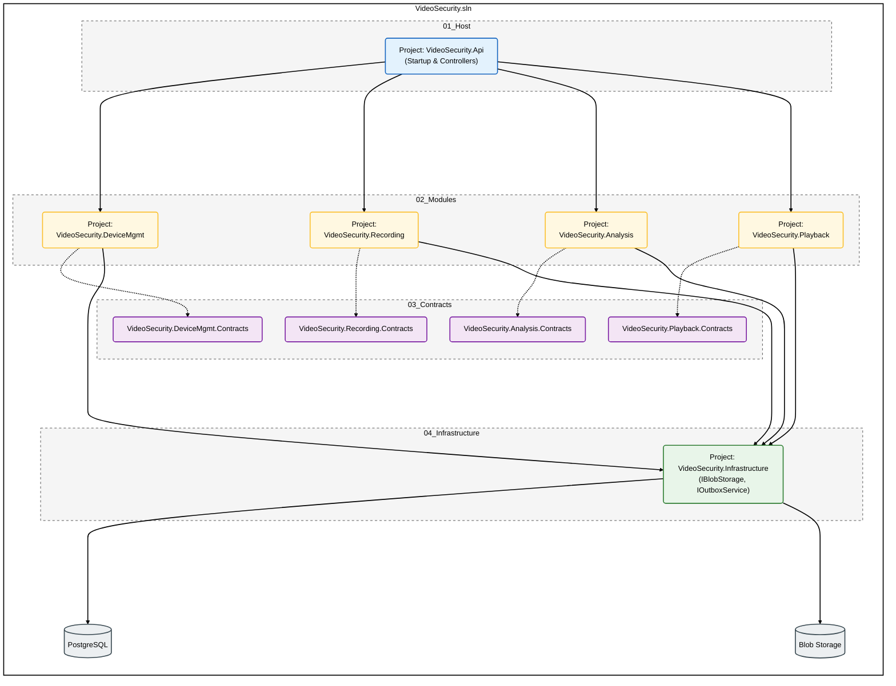

# VideoSecurity Geutebrück

Dieses Repository beinhaltet den Entwurf für ein Video Security System. Für den Einstieg in das Projekt wird die Aufgabe kurz skizziert und die grobe Architektur dargestellt und der Solution Aufbau dargestellt. Die Details zu den architekturellen Entscheidungen sind in der [backend.md](./00_Docs/backend.md) zu finden.  

- [VideoSecurity Geutebrück](#videosecurity-geutebrück)
  - [Stakeholder](#stakeholder)
  - [Aufgabenstellung: Backend-Entwurf "VideoSecurity"](#aufgabenstellung-backend-entwurf-videosecurity)
    - [Das Szenario: "VideoSecurity"](#das-szenario-videosecurity)
      - [Device Management:](#device-management)
      - [Recording:](#recording)
      - [Analyse:](#analyse)
      - [Playback \& Search:](#playback--search)
      - [Deine Aufgabe:](#deine-aufgabe)
      - [Anforderungen:](#anforderungen)
      - [Contracts \& Interfaces:](#contracts--interfaces)
      - [Das Konzept (backend.md):](#das-konzept-backendmd)
  - [High-Level Architektur](#high-level-architektur)
  - [Solution Aufbau](#solution-aufbau)

## Stakeholder
| Rolle | Name / Persona |
| :--- | :--- |
| **CTO** | *Tobias* |
| **Head Technology Strategy / Principal Architect** | *André* |
| **Supervisor HR** | Cindy |
| **Tech Lead Bewerber** | *Daniel* |

## Aufgabenstellung: Backend-Entwurf "VideoSecurity"
### Das Szenario: "VideoSecurity"
Wir planen ein skalierbares Video-Sicherheits-System. Langfristig streben wir eine verteilte
Architektur (Richtung Microservices) an, da Komponenten wie die Video-Analyse unabhängig
skalieren müssen. Das System besteht aus vier Kern-Domänen:
#### Device Management:
Verwaltung der Kameras (Konfiguration, Status).
#### Recording:
Entgegennahme und Speicherung von Videostreams.
#### Analyse:
Asynchrone Analyse der Videos (z.B. Motion Detection, Object Recognition).
#### Playback & Search:
Suche nach Events und Abruf der Aufzeichnungen.
#### Deine Aufgabe:
Erstelle einen konzeptionellen Entwurf in Form einer Visual Studio Solution. Wir
benötigen keinen lauffähigen Code und keine Implementierung der Business-Logik. Es geht rein
um das "Skelett" der Anwendung und die Definition der Schnittstellen.
#### Anforderungen:
Backend Struktur (.NET): Lege die Solution mit den entsprechenden C#-Projekten (.csproj) und
Ordnern an. Die Projekte dürfen leer sein oder nur leere Klassen/Interfaces enthalten. Die Struktur
soll zeigen, wie du die Domänen schneidest (Boundaries) und wie du sicherstellst, dass das
System modular bleibt.
#### Contracts & Interfaces:
Definiere die wichtigsten Interfaces und DTOs (Data Transfer Objects). Wir wollen anhand der
Signaturen sehen, wie die Module miteinander "sprechen" (Datentypen, Rückgabewerte, Async).
#### Das Konzept (backend.md):
Erkläre in einer Markdown-Datei kurz deine Entscheidungen. Beantworte bitte konkret:
Vorgehensweise: Wie schneidest du das Projekt – was entwickelst du zuerst?
Dependencies: Welches Projekt referenziert welches?
Wie verhinderst du enge Kopplung?
Kommunikation: Wie interagieren die Module? (z.B. Wie erfährt Intelligence, dass Recording ein
neues Video hat?)
Daten-Strategie: Wo und wie werden die massiven Videodaten (Blobs) vs. Metadaten
gespeichert?
## High-Level Architektur
Überblick über die logischen Bausteine und ihre Abhängigkeiten. Die Lösung ist in vertikale **Module** (Fachlichkeiten) und horizontale **Schichten** (Technik) geschnitten.

## Solution Aufbau
VideoSecurity.sln  
├── 01_Host  
│   └── VideoSecurity.Api            (ASP.NET Core)   
│       ├── Controllers  
├── 02_Modules  
│   ├── VideoSecurity.DeviceMgmt     (Domain & Application Layer)  
│   ├── VideoSecurity.Recording      (Domain & Application Layer)  
│   ├── VideoSecurity.Analysis       (Domain & Application Layer)  
│   └── VideoSecurity.Playback       (Domain & Application Layer)  
├── 03_Contracts                     (Shared Interfaces & DTOs)  
│   ├── VideoSecurity.DeviceMgmt.Contracts  
│   ├── VideoSecurity.Recording.Contracts  
│   ├── VideoSecurity.Analysis.Contracts  
│   └── VideoSecurity.Playback.Contracts  
└── 04_Infrastructure                (Shared Kernel, z.B. Database, BlobStorage)  